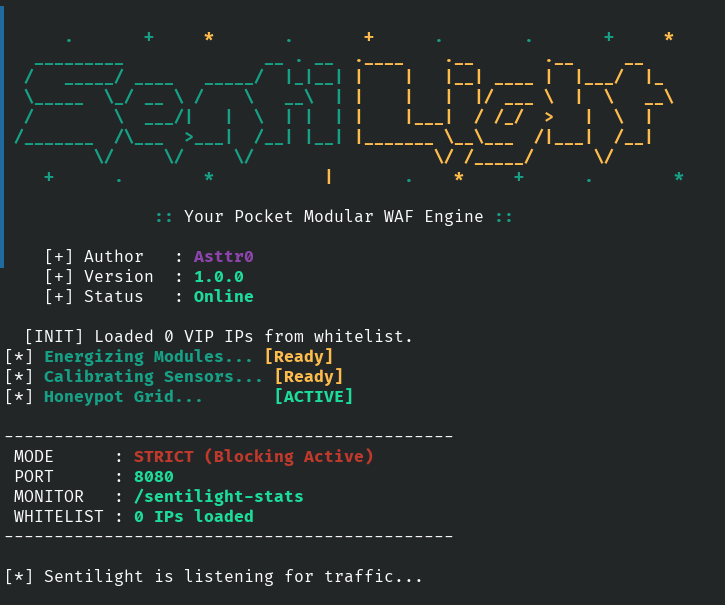
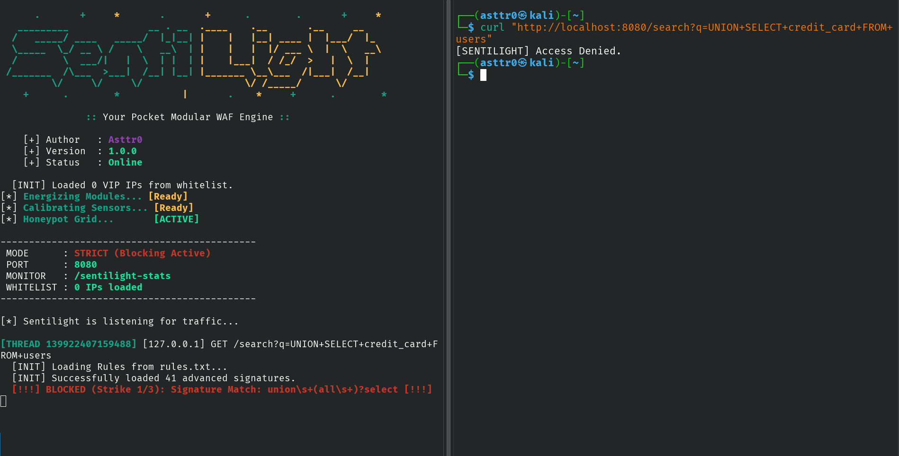
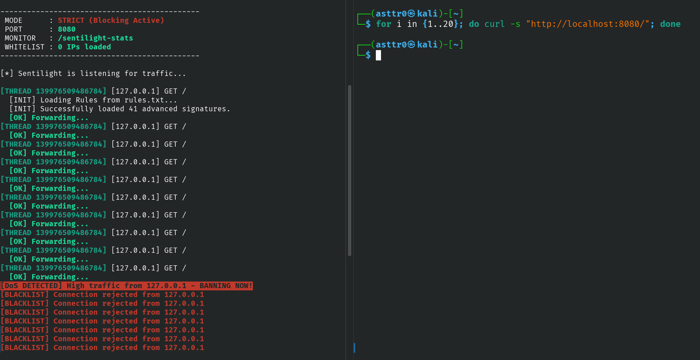
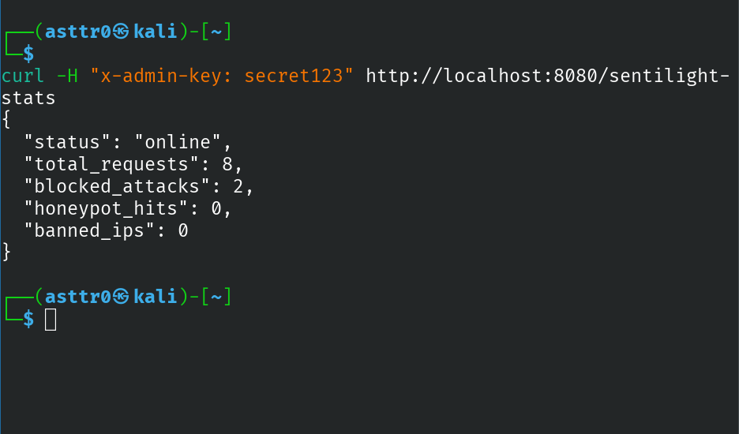

# 🛡️ Sentilight WAF
> **The Titanium-Grade C++ Fortress for Your Web Server.**


---

## 📖 Overview
**Sentilight** is a lightweight, high-performance **Web Application Firewall (WAF)** built entirely from scratch in C++. Unlike standard WAFs that rely on heavy frameworks, Sentilight operates as a **Reverse Proxy** using raw POSIX sockets, providing granular control over every byte of traffic.

It is designed to sit in front of your backend server (Python, Node.js, Apache, etc.) and filter incoming traffic in real-time, neutralizing threats before they ever reach your application.

---

## 📸 Gallery

**1. The Interface**


**2. Blocking SQL Injection (Signature Detection)**


**3. Stopping a DoS Attack (Rate Limiting)**


**4. Real-Time Admin Stats**


---

##  Key Features

###  Intelligent Threat Detection
* **Advanced Regex Engine:** Utilizes the "Titanium Ruleset" to detect complex attacks like **SQL Injection (SQLi)**, **Cross-Site Scripting (XSS)**, **Remote Code Execution (RCE)**, and **LFI**.
* **Entropy Analysis:** Uses Shannon Entropy mathematics to detect and block obfuscated payloads (e.g., Base64 or Hex hidden shells).
* **Anti-Evasion:** Automatically URL-decodes payloads (e.g., `%27 OR 1=1`) to prevent bypass attempts.
* **Protocol Enforcement:** Enforces a "Zero Trust" policy, strictly allowing only `GET` and `POST` methods.

###  Active Defense System
* **DoS Mitigation:** Integrated **Rate Limiting** bans IPs that exceed 10 requests/second.
* **IP Blacklisting (The Jail):** Automatically bans repeat offenders for 5 minutes after 3 strikes.
* **The "Bouncer":** Identifies and blocks automated scanning tools (`sqlmap`, `Nikto`, `Hydra`) via User-Agent fingerprinting.
* **Honeypot Mode:** Can serve fake vulnerability data to deceive attackers and waste their time (`--honey` flag).

###  Observability & Control
* **DLP (Data Loss Prevention):** Scans outgoing server responses to censor sensitive data leaks (e.g., `root:x:0:0`, SQL syntax errors).
* **VIP Whitelisting:** Trusted IPs in `whitelist.txt` bypass all security checks for administrative access.
* **Live Stats Dashboard:** Real-time JSON monitoring via the secured `/sentilight-stats` endpoint.

---

##  Installation & Build

### Prerequisites
* **Linux/Unix** environment (Kali, Ubuntu, MacOS).
* **g++** (with C++17 support).
* **Make**.

### 1. Clone the Repository
```bash
git clone [https://github.com/Asttr0/SentiLight.git](https://github.com/Asttr0/SentiLight.git)
cd SentiLight
```

### 2. Compile
Sentilight includes a Makefile for one-command compilation.
```bash
make
```

##  Usage
Start the WAF on port 8080. It will forward safe traffic to your backend (default: port 9000).
```bash
./sentilight --port 8080
```
Command Line Options :

Flag	Description
```bash
--port <p>	Set the listening port (Default: 8080).
--honey	Activate Honeypot Mode (Returns fake errors instead of 403 blocks).
--help	Show the help menu.
``` 

##  Configuration 

### 1. Blocking Rules (rules.txt) :
   
Sentilight hot-loads security rules from this file. It supports standard Regex.
 Example Rules :
 ```bash
union\s+select      # Block SQLi
<script>            # Block XSS
/etc/passwd         # Block LFI
``` 

### 2. Whitelist (whitelist.txt) :
  
Add trusted IPs here (one per line) to bypass the WAF entirely.
```bash
127.0.0.1
192.xxx.x.xx
``` 

##  Testing the Defenses
ou can verify the WAF is working using curl:

### 1. Test SQL Injection Block:

```bash
curl "http://localhost:8080/search?q=UNION+SELECT"
# Output: HTTP 403 Forbidden [SENTILIGHT] Access Denied.
```
### 2. Test DoS Protection (Rate Limit):

  ```bash 
for i in {1..15}; do curl -s "http://localhost:8080/" > /dev/null; done
# Output: [DoS DETECTED] High traffic from 127.0.0.1 - BANNING NOW!

3. Access Live Stats (Requires Key):
Bash

curl -H "x-admin-key: secret123" http://localhost:8080/sentilight-stats
```

## ⚠️ Disclaimer

Sentilight is intended for educational and defensive purposes only. Do not use this tool to protect critical infrastructure without proper testing. The author is not responsible for any misuse of this software.

##  Contributing

Pull requests are welcome! For major changes, please open an issue first to discuss what you would like to change.
## 
Created with ❤️ by Asttr0
